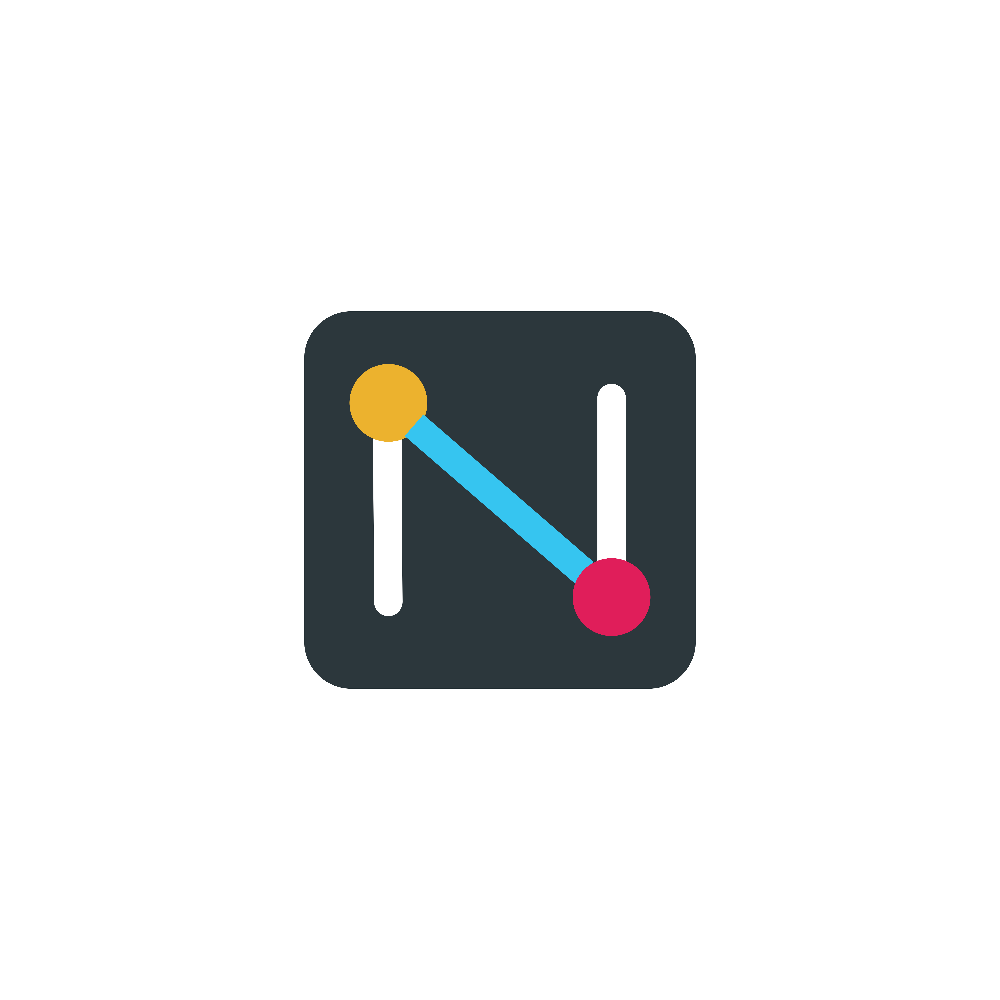

<!--
SPDX-FileCopyrightText: 2026 AOT Technologies

SPDX-License-Identifier: Apache-2.0
-->

# node wire

[](https://github.com/AOT-Technologies/node-wire/actions/workflows/pytest.yml)
[](https://github.com/AOT-Technologies/node-wire/actions/workflows/codeql.yml)
[](https://pypi.org/project/node-wire/)
[](https://github.com/AOT-Technologies/node-wire/releases/latest)
[](LICENSE)
<p align="center">
  
</p>
node wire is a three-layer Python platform that runs connector adapters (Google Drive, SMTP, Stripe, FHIR, etc.) and exposes them over REST, gRPC, or MCP. It provides a consistent execution contract with built-in validation, resilience, and telemetry.

## Prerequisites

Before getting started, make sure you have:

| Requirement | Version | Notes |
|---|---|---|
| Python | 3.11+ | Required to run the platform |
| `uv` or `pip` | Latest | `uv` is recommended for local development |
| Git | Any recent version | Required to clone the repository |
| Docker | Latest | Required for MCP server image builds and `docker-compose.mcp.yml` |
| Node.js | Any LTS | Only needed for MCP Inspector |

## Quick Start

### 1. Install
```bash
git clone https://github.com/AOT-Technologies/node-wire.git
cd node-wire
uv sync --frozen --all-extras --dev
```
*(Requires `uv`. See [Installation](docs/installation.md) for lockfile update workflow.)*

### 2. Configure
Copy the sample environment file and add your `NW_ALLOWED_CONNECTORS`:
```bash
# Linux/macOS/PowerShell
cp sample.env .env

# Windows (CMD)
copy sample.env .env
```
*(Edit `.env` and set `NW_ALLOWED_CONNECTORS=http_generic` or others)*

### 3. Run Grafana/OpenTelemetry (optional)

For telemetry visualization, start the Grafana stack before running the application:

```bash
cd grafana && docker compose up -d
```


### 4. Run
**Bash (Linux/macOS):**
```bash
# Using uv (recommended)
MODE=API uv run node-wire

# Using python
MODE=API python -m bindings_entrypoint
```

**PowerShell (Windows):**
```powershell
# Using uv
$env:MODE="API"; uv run node-wire

# Using python
$env:MODE="API"; python -m bindings_entrypoint
```
*(Modes: `API`, `GRPC`, `MCP`)*

Open [http://localhost:8000/docs](http://localhost:8000/docs) to see the Swagger UI.

### 5. Playground

The platform includes an interactive web playground at [http://localhost:8000/playground/](http://localhost:8000/playground/) (available when the REST API is running).

---

## Build Packages (Wheels)

Before building Docker images, build the Python packages as binary wheels:

```bash
bash scripts/build-packages.sh
```

See [docs/packaging.md](docs/packaging.md) for details on the wheel build lifecycle.

---

## Build MCP Server Images

Use this workflow when you want Docker images for the individual MCP servers such as Google Drive, SMTP, Stripe, Salesforce, or Slack.

### Build prerequisites

Before building images, make sure:

- Docker is installed and available on your shell path.
- You are running commands from the repository root.
- Local wheels have been built first.

See [docs/local-packages-to-images.md](docs/local-packages-to-images.md) for the full package -> image workflow and required wheel artifacts per image.

### Build all MCP server images

All MCP server images are built from the repository root using the automation script:

```bash
./scripts/build-mcp-images.sh
```

To tag with a specific version (defaults to the version in `pyproject.toml`):

```bash
./scripts/build-mcp-images.sh --version 1.0.0
```

This produces images tagged as both `latest` and the version string:

| Image name | Tags |
|---|---|
| `nw-google-drive` | `nw-google-drive:latest`, `nw-google-drive:1.0.0` |
| `nw-smartonfhir-epic` | `nw-smartonfhir-epic:latest`, `nw-smartonfhir-epic:1.0.0` |
| `nw-smartonfhir-cerner` | `nw-smartonfhir-cerner:latest`, `nw-smartonfhir-cerner:1.0.0` |
| `nw-smtp` | `nw-smtp:latest`, `nw-smtp:1.0.0` |
| `nw-stripe` | `nw-stripe:latest`, `nw-stripe:1.0.0` |
| `nw-salesforce` | `nw-salesforce:latest`, `nw-salesforce:1.0.0` |
| `nw-slack` | `nw-slack:latest`, `nw-slack:1.0.0` |

### Build one image manually

To build a single image manually from the repo root:

```bash
# Google Drive only
docker build -f docker/google-drive/Dockerfile -t nw-google-drive:latest .

# Epic FHIR only
docker build -f docker/fhir-epic/Dockerfile -t nw-smartonfhir-epic:latest .

# Cerner FHIR only
docker build -f docker/fhir-cerner/Dockerfile -t nw-smartonfhir-cerner:latest .

# SMTP only
docker build -f docker/smtp/Dockerfile -t nw-smtp:latest .

# Stripe only
docker build -f docker/stripe/Dockerfile -t nw-stripe:latest .

# Salesforce only
docker build -f docker/salesforce/Dockerfile -t nw-salesforce:latest .

# Slack only
docker build -f docker/slack/Dockerfile -t nw-slack:latest .
```

> **Note:** The build context must be the repository root (`.`) so the `COPY src/` and `COPY config/` instructions resolve correctly.

---

## Run MCP Servers with Docker Compose

### Compose prerequisites

Before starting the MCP containers, make sure:

- The MCP server images have already been built locally.
- Your `.env` file is populated with the credentials needed by the connectors you want to run.

`docker-compose.mcp.yml` starts all MCP servers as stdio containers in one command. This is useful for local validation before configuring ToolHive.
Each service pins `NW_ALLOWED_CONNECTORS` to its own connector so a broad value in `.env` does not make per-connector images import optional dependencies they do not contain.

```bash
# Ensure local wheels exist and your .env is populated, then:
docker compose -f docker-compose.mcp.yml up --build
```

To start only a specific server:

```bash
docker compose -f docker-compose.mcp.yml up --build nw-smartonfhir-epic
```

---

## Documentation

For more detailed information, please refer to the following guides:

- **[Architecture](docs/architecture.md)** — Layered design and data flow.
- **[Installation](docs/installation.md)** — Detailed setup and prerequisites.
- **[Configuration](docs/configuration.md)** — Environment variables and `connectors.yaml`.
- **[Connectors Guide](docs/connectors.md)** — How to use and build connectors.
- **[MCP Integration](docs/mcp.md)** — Using node wire with AI agents.
- **[Troubleshooting](docs/troubleshooting.md)** — Common errors and fixes.
- **[MCP Servers & Docker](docs/mcp-servers.md)** — Deploying individual connectors as MCP servers.
- **[Packaging & Publishing](docs/packaging.md)** — Wheel builds and CI flow.
- **[Release Rollback](docs/release-rollback.md)** — PyPI yank and corrective release procedure.
- **[Code Quality & Compliance](docs/code-quality-compliance.md)** — Ruff, Mypy, pre-commit, REUSE, and dependency compliance.
- **[Privacy](docs/privacy.md)** — Data handling and logging guidance.
- **[HIPAA Considerations](docs/compliance/hipaa-considerations.md)** — Deploying node wire in regulated healthcare environments.
- **[ToolHive Agent Scenario](docs/toolhive_agent_scenario.md)** — End-to-end FHIR → Google Drive → email workflow.
- **[Changelog](CHANGELOG.md)** — Release history.

## Developer docs

- Individual connector MCP servers (ToolHive): [docs/mcp-servers.md](docs/mcp-servers.md)
- Creating a new connector: [docs/connectors.md](docs/connectors.md)
- Code quality/compliance (Ruff, Mypy, REUSE, pip-audit): [docs/code-quality-compliance.md](docs/code-quality-compliance.md)
- Quality/security gates (Bandit, CodeQL): [docs/quality-security-gates.md](docs/quality-security-gates.md)

---

## Contributing

Contributions are welcome! Please read [CONTRIBUTING.md](CONTRIBUTING.md) for
the development setup, quality checks, and PR conventions, and our
[Code of Conduct](CODE_OF_CONDUCT.md).

## Security

To report a vulnerability, please follow our [Security Policy](SECURITY.md). Do
not open a public issue for security reports.

---

## License

This project is licensed under the Apache License 2.0.
See the LICENSE file for details.
