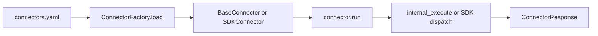

# Connectors guide (`src/connectors`)

This guide explains how **connectors** fit into Node Wire, how **`BaseConnector`** and **`SDKConnector`** differ, and how to configure and invoke them. Connector implementations live under `src/connectors/`; the shared base classes live under **`src/runtime/`** (`BaseConnector` in `runtime/base.py`, `SDKConnector` in `runtime/sdk_connector.py`).

---

## Package layout and registration

Each connector is a **subpackage** of `connectors`:

| File | Role |
|------|------|
| `schema.py` | Pydantic input/output models (and, for SDK connectors, one model per action with an `action` discriminator where needed). |
| `logic.py` | Connector class: `BaseConnector` or `SDKConnector` subclass, plus `internal_execute` or `@sdk_action` handlers. |
| `registration.py` | Optional: registers connector-specific exceptions with `ErrorMapper`. |
| `exceptions.py` | Optional: custom exception types. |

At startup, call **`connectors.auto_register()`** (see [`src/connectors/__init__.py`](../src/connectors/__init__.py)): it imports each subpackage’s `logic` (which triggers `SDKConnector` subclass registration) and then `registration` when present.

---

## `BaseConnector` vs `SDKConnector`

| | **BaseConnector** | **SDKConnector** |
|---|-------------------|-------------------|
| **Use case** | A single operation per connector class: one `connector_id`, one `action` string, one input model and one output model. | Multiple operations in one class: several named actions, each with its own input/output types. |
| **Implementation** | Subclass `BaseConnector`, set `connector_id` and `action`, implement `async def internal_execute(self, params, *, trace_id)`. | Subclass `SDKConnector`, set `connector_id`, `output_model`, and either **`@sdk_action("name")`** methods or **`action_specs`** (see below). |
| **Input validation** | One Pydantic model for `run()`. | A **discriminated union** of input models (field **`action`** selects the handler). |
| **Factory** | Explicit construction in [`ConnectorFactory._instantiate`](../src/bindings/factory.py): pass `(input_model, output_model, secret_provider=...)`. | **`_CONNECTOR_REGISTRY`**: `SDKConnector(secret_provider=...)` only. |
| **Manifest** | One row per connector ([`build_manifest`](../src/connectors/manifest.py)). | One row **per** `@sdk_action` / spec entry. |

Both types expose the same public entrypoint: **`await connector.run(raw_dict)`**, which validates input, runs optional policy, applies retries/circuit breaking, maps errors, and returns a **`ConnectorResponse`**.



---

## `BaseConnector` — single action

**Characteristics:**

- **`connector_id`** and **`action`** identify the operation (e.g. `http_generic` + `request`).
- **`internal_execute`** receives already-validated **`params`** (instance of the input model) and must return an instance of the output model.
- The constructor is **`BaseConnector(input_model, output_model, secret_provider=..., ...)`**; bindings use **`run(dict)`**, not `internal_execute`, for the full pipeline.

**When to use:** One clear operation, no need for multiple discriminated actions in a single class. New `BaseConnector` types must be **wired in** [`ConnectorFactory._instantiate`](../src/bindings/factory.py) (current behavior).

### Example connectors

| Connector | `connector_id` | `action` | Reference |
|-----------|----------------|----------|-----------|
| **HTTP generic** | `http_generic` | `request` | [`HttpGenericConnector`](../src/connectors/http_generic/logic.py) |
| **SMTP** | `smtp` | `send_email` | [`SmtpConnector`](../src/connectors/smtp/logic.py) |

### Example payload: `http_generic` (`POST` body to REST)

No `action` field is required in the JSON body for a pure `BaseConnector`; routing is by URL path `/connectors/http_generic/request`.

```json
{
  "method": "GET",
  "url": "https://httpbin.org/get",
  "headers": { "Accept": "application/json" },
  "params": null,
  "body": null
}
```

Fields match [`HttpRequestInput`](../src/connectors/http_generic/schema.py): `url`, `method`, optional `headers`, `params`, `body`.

### Example payload: `smtp`

```json
{
  "from_email": "sender@example.com",
  "to": ["recipient@example.com"],
  "subject": "Hello",
  "body": "Plain text body."
}
```

`host`, `port`, `use_tls`, and credential key names can be omitted when defaults/env are set; see [`SmtpSendInput`](../src/connectors/smtp/schema.py).

---

## `SDKConnector` — multiple actions

**Characteristics:**

- **`connector_id`** is fixed; default class-level **`action`** is often **`"execute"`** (per-action names are what matter for manifest and routing).
- Actions are declared with:
  - **`@sdk_action("action_name")`** on **`async def`** methods with typed **`params`** and return type, or
  - **`action_specs`**: a dict of `SdkActionSpec` entries that **generate** `@sdk_action` handlers (used by Google Drive; see [`_generate_methods_from_action_specs`](../src/runtime/sdk_connector.py)).
- Every input model participating in the union must include an **`action`** field (typically a `Literal[...]`) so validation can pick the right branch.
- Runtime **`internal_execute`** resolves **`action`** and calls the matching method ([`SDKConnector.internal_execute`](../src/runtime/sdk_connector.py)).
- Subclasses register automatically in **`_CONNECTOR_REGISTRY`** when `connector_id` is set on the class.

**When to use:** Multiple operations (FHIR, Drive, Stripe), one shared client or config, and one manifest entry per tool/operation.

### Example patterns in this repo

| Connector | Pattern | Reference |
|-----------|---------|-----------|
| **stripe** | Single `@sdk_action("charge")`; `ChargeInput` includes `action: Literal["charge"]` | [`stripe/logic.py`](../src/connectors/stripe/logic.py), [`stripe/schema.py`](../src/connectors/stripe/schema.py) |
| **google_drive** | `action_specs` + shared `GoogleDriveOperationOutput` | [`google_drive/logic.py`](../src/connectors/google_drive/logic.py) |
| **fhir_epic** / **fhir_cerner** | Multiple `@sdk_action` methods, shared FHIR HTTP/auth setup | [`fhir_epic/logic.py`](../src/connectors/fhir_epic/logic.py), [`fhir_cerner/logic.py`](../src/connectors/fhir_cerner/logic.py) |

### Example payload: `stripe`

```json
{
  "action": "charge",
  "amount": 2000,
  "currency": "usd",
  "source": "tok_visa",
  "description": "Test charge"
}
```

### Example payload: FHIR Epic — `read_patient` by id

```json
{
  "action": "read_patient",
  "resource_id": "eJzY123"
}
```

For search-by-name or other flows, use the fields documented on [`FhirPatientReadInput`](../src/connectors/fhir_epic/schema.py) (e.g. `given_name`, `family_name`, `search_params`). Cerner uses parallel types under [`fhir_cerner/schema.py`](../src/connectors/fhir_cerner/schema.py).

### Programmatic note (`internal_execute`)

For in-process calls, pass a **validated** input model that includes **`action`** for SDK connectors, for example:

`await connector.internal_execute(FhirPatientReadInput(action="read_patient", resource_id="..."), trace_id="...")`.

---

## Connector inventory

| Connector | Base vs SDK | Primary actions (conceptual) |
|-----------|-------------|------------------------------|
| `http_generic` | Base | `request` |
| `smtp` | Base | `send_email` |
| `stripe` | SDK | `charge` |
| `google_drive` | SDK | e.g. `files.list`, `files.upload`, … (see manifest / `action_specs`) |
| `fhir_epic` | SDK | `read_patient`, `search_patients`, `search_encounter`, `create_document_reference`, `search_document_reference`, … |
| `fhir_cerner` | SDK | Same family as Epic, Cerner-specific schemas |

Exact tool names for MCP are typically **`<connector_id>.<action>`** (e.g. `fhir_epic.read_patient`, `google_drive.files.upload`). See [`docs/mcp-servers.md`](mcp-servers.md).

---

## Configuration and invocation

### `config/connectors.yaml`

Each connector entry can set:

- **`enabled`**: if false, the factory does not instantiate it.
- **`exposed_via`**: list of protocols, e.g. `rest`, `grpc`, `mcp` (REST/gRPC/MCP layers filter on this).
- **Connector-specific keys** (e.g. FHIR `base_url`, `oauth_token_url`).

See [`config/connectors.yaml`](../config/connectors.yaml).

### `ConnectorFactory`

[`ConnectorFactory`](../src/bindings/factory.py):

- **`load()`** — reads YAML and builds connector instances.
- **`get_for_protocol(connector_id, protocol, action=None)`** — returns the connector if enabled, exposed for that protocol, and loaded; `action` is accepted for logging/parity (same instance for all actions on an SDK connector).
- **`list_for_protocol(protocol)`** — all connectors exposed for that protocol.

### Bindings

REST, gRPC, and MCP call **`connector.run(payload)`** with a JSON-serializable dict. For **SDK** connectors, the dict must satisfy the discriminated union (include the correct **`action`**).

---

## Adding a new connector (checklist)

1. Create `src/connectors/<connector_id>/` with `schema.py` and `logic.py`.
2. Choose **BaseConnector** (single action) or **SDKConnector** (multiple `@sdk_action` or `action_specs`).
3. Register **`error_map`** on `SDKConnector` and/or add **`registration.py`** for custom exceptions.
4. Add the connector to **`config/connectors.yaml`** with **`enabled`** and **`exposed_via`**.
5. If the connector is **`BaseConnector`**, add an **`elif`** branch in **`ConnectorFactory._instantiate`** (current code path). **`SDKConnector`** subclasses self-register; no extra factory branch is needed.

---

## Related documentation

- [mcp-servers.md](mcp-servers.md) — MCP images, ToolHive, env vars.
- [google_drive_connector.md](google_drive_connector.md) — Drive REST API and setup.
- Per-connector READMEs under `src/connectors/*/README.md` where present (e.g. FHIR).
